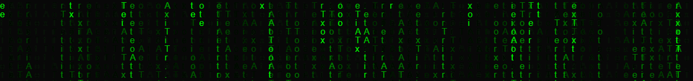
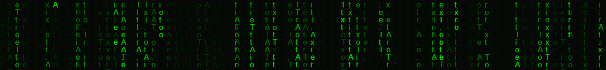

<h1 align="center"> ♡ 𝓘𝓼𝓪𝓫𝓮𝓵 ∯𝓒𝓪𝓵𝓬𝓾𝓵𝓾𝓼∞⊉⊷ 𝓛𝓲𝓯𝓾 ♡</h1>
<h3 align="center">Welcome to my profile! Become a part of my official <a href="https://discord.gg/PBfu7XHAwH">Discord server!</a></h3>

 
<h3>

╔══╗─────╔╗────╔╗─╔╗────╔═╗───       
╚╣╠╝─────║║────║║─║║────║╔╝─── 
─║║╔══╦══╣╚═╦══╣║─║║──╔╦╝╚╦╗╔╗ 
─║║║══╣╔╗║╔╗║║═╣║─║║─╔╬╬╗╔╣║║║ 
╔╣╠╬══║╔╗║╚╝║║═╣╚╗║╚═╝║║║║║╚╝║ 
╚══╩══╩╝╚╩══╩══╩═╝╚═══╩╝╚╝╚══╝ 

<h4 align="center"><a href="https://valensce.github.io/T1-HTML-Assignment/About_the_author.html">Here's</a> a website about me and my pets.  
</h4>

	 <!--Profile views-->
	 <!--Contact-->
	 <!--Shoutout for Johnny!-->
	 <!--Shoutout for Brianna!-->
	  <h3 align="center">Please visit my organisation's homepage! => https://xpavilion.github.io/ </h3>
	
<h3 align="center">Supporters: </h3>
	 <!--Johnny-->
	 <!--Natascha-->
	 <!--Jeremy-->
	 <!--Valerie-->
	 <!--Supernova7-->
	 <!--Mr. Henley-->
	 <!--SM-->
	 <!--Charlotte-->
	 <!--Brianna-->
	 <!--Lh(n)-->
	 <!--Samuel-->
	 <!--I pioneered spotify! I am an entrepreneur!-->

 <h3 align="center"> Apps/Languages/Prados that I use: </h3>
	<!--Apple-->
	<!--Discord-->
	<!--Atom-->
	<!--Chromium-->
	<!--CSS-->
	<!--Dreamweaver-->
	<!--Excel-->
	<!--GitHub-->
	<!--Grammarly-->
	<!--HTML-->
	<!--JavaScript-->
	<!--Khan Academy-->
	<!--OneDrive-->
	<!--Pokémon-->
	<!--Python-->
	<!--Tampermonkey-->
	<!--Windows-->

	
- 🔭 I’m currently working on Trigonometric Identities' proof using exponential complex numbers in the Polar system!

- 💻 All of my projects are available in my classroom of Math books I've written! Only about 3.1415926535897932384626433832795028841971693993751058209749445923078164062862089986828034825% of my work is done in [Desmos](https://www.desmos.com/calculator/wdnrf65gtc)! 

- 🥇 I'm most experienced with Vector Calculus and Further Graphing Techniques!

- 🌱 I’m currently learning how to prove all sorts of cool trigonometric identities using complex numbers in their polar form! I'm looking forward to learn how they can be applied in matrices!
- 🏆 If you have any questions you can't solve within the year 11 [Specialist Mathematics](https://github.com/Specialist-Mathematics) curriculum for Queensland, ask [me](mailto:ba004745@bac.qld.edu.au) or [Prado](mailto:pradolifu@gmail.com)! 

	   <!--Trophies-->
	  
	  
	  
	  

<h3 align="center"> School projects for <a href="https://github.com/digital-technologies">Mr Henley</a></h3>

	
	
	

About <a href="https://github.com/Valensce">Me</a>

<h4>Date of Birth: 21st December 2007 
Birth Place: <a href="https://www.google.com/maps/place/Sunnybank+Private+Hospital/">Sunnybank Private Hospital</a>, Brisbane, Australia 
Favourite subject: <a href="https://github.com/Specialist-Mathematics">Specialist Mathematics</a> 
Favourite topic: <a href="https://github.com/Specialist-Mathematics">Vector Calculus</a> 
Placing in family: First and only child 
Pets: A Golden Retriever called Prado, A German Shepherd called Sylvia 
Fun fact: I skipped year eight in 2021!</h4>

About <a href="https://github.com/Valensce">Prado</a> (who thinks he's a human)

<h4>Breed: <a href="https://dogtime.com/dog-breeds/golden-retriever/">Golden Retriever</a> 
Species: Canis lupus familiaris (Dog) 
Gender: Male  
Date of birth: 23rd March 2019 (Almost 2 years old) 
Birth Place: <a href="https://www.google.com/maps/place/Blue+Mountains/">Blue Mountains, Sydney, Australia</a> 
Love rate: 100% pure love  
Name history: My family bought a 2019 Toyota Land Cruiser Prado right before buying him,  
so we called him Prado too XD</h4>

About <a href="https://github.com/Valensce">Sylvia</a> (who also thinks she's a human)

<h4>Breed: <a href="https://thehappypuppysite.com/sable-german-shepherd/">Sable German Shepherd</a> 
Species: Canis lupus familiaris (Dog) 
Gender: Female 
Date of Birth: 23rd February 2021 (Yes, she's a puppy, currently 15 weeks old!) 
Birth Place: <a href="https://www.google.com/maps/place/Sunnybank/">Sunnybank, Brisbane, Australia</a> 
Love rate: 100% pure love 
Name history: Her fur has a silverish lining on the outside (which gave me the motive to call her Sylvia!), visible in most lighting, except indoors - She turns brown XD</h4>

About my friends

	

About <a href="https://github.com/TurnipGuy30/">TurnipGuy30</a>

		Johnny Dieckmann! An unsurpassable hacker, coder, programmer, mathematician, physicist, chemist, and engineer!
	

	

	

About <a href="https://github.com/hacking-mudkip/">hacking-mudkip</a>

		Natascha Tennent! A superb golfer and Pokémon player
	

	

	

About <a href="https://github.com/Jeremy-Tsai-310206-XJosh/">☾ Snow</a>

		Jeremy Tsai! A true friend whom I appreciate.
	

	

	

About <a href="https://github.com/supernova7/">Supernova7</a>

		Supernova7! An anonymous user who contributes in many of our private repositories.
	

	

	

About <a href="https://github.com/teethtastegood/">teethtastegood</a>

		Charlotte Tye! An awesome friend who loves collaborating with others!
	

	

	

About <a href="https://github.com/brizyyy/">Brizyyy</a>

		Brianna Cardenas! An incredibly intelligent study buddy!
	

	

	

About <a href="https://github.com/lahonathon/">Lh(n)</a>

		Lh(n)! Yes, the one from XPaVilion!
	

	

	

About <a href="https://github.com/Mulky-bot/">MuLKy bot</a>

		Samuel Garay! He is not a bot LOL
	

	

	

About <a href="https://github.com/digital-technologies/">Digital Technologies</a>

		Mr. J Henley! #Cool #BestTeacher #PassionateForOurFutures #WillingToHelpOut
	

	

	

About <a href="https://github.com/valerimatical/">Valerimatical</a>

		Valerie! The Fairy-type Gym Leader from Kalos is now helping out in my org XPaVilion!
	

	

	

About <a href="https://github.com/Specialist-mathematics/">Specialist Mathematics</a>

		Specialist Mathematics! The best subject in the world! It's just really cool to finally own an account called my favourite subject - I'm so glad it hasn't 		   been taken already on Github! Let's go Specialist Mathematics!!!
	

	

	

About <a href="https://github.com/isabel-lifu/">Isabel</a>

		Obviously, that's me again! My Beta acc.
	

	

	

About <a href="https://github.com/lachy06/">Lachlan</a>

		Lachlan Quodrill! Another classmate & friend ✧
	

	

⯈ ⯈
Well done - You've found a secret message: Please follow me! Even Prado's suggesting you to do so! <pre>There he is!</pre> 

🐕
OMG YOU'VE FOUND AN ULTRA-PRIVATE MESSAGE! Let me show you this hilarious repo => Click <a href="https://github.com/Valensce/Prados-Aquarium">here</a>

- [ ] I've read about your dogs somewhere before and they're ♡♡♡!
- [ ] I would love to see more about your dogs in a public repo
- [ ] Please follow <a href="https://github.com/Valensce">meh</a> 😎

<h3 align=center>I love you all so much!!! Thank you for reading my profile!!</h3>
 

Bonus

 YOU ARE A PRADO!  

	

Extras
 
        Here are some links to my latest projects:  @https://www.desmos.com/calculator/jq45wqtbwj  @https://www.desmos.com/calculator/rt7ppxlzrt  @https://www.desmos.com/calculator/f4dz8fmr0j  

 Fun fact of the day

 
Most ions have the same electron arrangement as the noble gas (group 18 element) that is closest to them on the periodic table.
	  
	

	

Education Perfect World Record! 
 
	https://user-images.githubusercontent.com/79883837/124372620-f5ca9480-dcce-11eb-8b8c-9d75bb265eaa.png
	https://user-images.githubusercontent.com/79883837/124372628-ffec9300-dcce-11eb-893e-30614f451c10.png
	

More fun
 
https://github.com/Valensce/ProvingTrigonometricIdentitiesUsingComplexNumbers (my edited version of StackExchange)

Did you know
 
A series circuit is where all of the circuit components are joined together in a single loop. They are essentially in a line, with a current flowing through them consecutively. The current maintains the same strength all around the circuit. The voltage will vary around the circuit depending on the resistance of the components. There will be a larger voltage over a component with a higher resistance. The voltage of the energy users around the circuit can be added together to calculate how much voltage the battery or energy source is supplying to the circuit.

